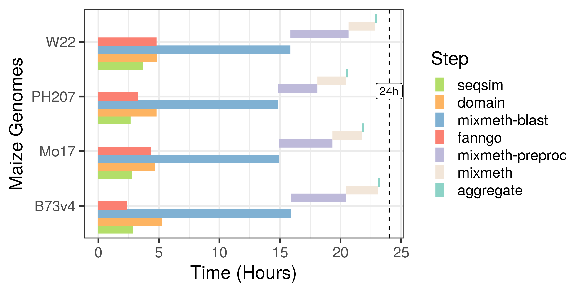

.. _REQUIREMENTS:

Requirements
============

Software
--------
 
* `Singularity`_ >= 3.5.2
* Linux-based System for the use of **Shell scripts** in the repo
    * `Windows Subsystem for Linux <https://docs.microsoft.com/en-us/windows/wsl/install-win10>`_ (WSL) or WSL2 systems have issues with Singularity so those require additional configuraion 

.. _Singularity: https://sylabs.io/singularity/

The GOMAP system requirements are significantly high due to the use of InterProScan and BLASTP against UniProt database sequences.

Currently the runtime of GOMAP-singularity container is in hours for plant genomes on HPC systems and these have been parallelized to a certain extent, but still require significant computational power.

Image below shows the runtimes for GOMAP on the Pittsburgh Supercomputing Center (PSC) `Bridges`_ HPC Cluster. GOMAP steps were run on Regular Shared Memory nodes. Each regular shared memory node is configured with two Intel Haswell (E5-2695 v3) CPUs (28 Total CPU cores) and 128 GB memory. 

.. _Bridges: https://www.psc.edu/resources/bridges/

.. warning::
    Currently GOMAP is not meant to be run on a single machine or desktop systems. This will take days or weeks to complete for a single genome. Please use a HPC system setup with Torque or Slurm for running Singularity

Using Singularity in HPC
------------------------
Most HPC systems have singularity installed and ready to use. You can check if singularity is available by checking  in Spack based environment modules by using the command in line 1. If singularity is installed then it can be loaded by runisssng the line 2.

.. code-block:: bash

    #Check if singularity is installed
    module avail singularity
    module spider singularity

    #Load singularity
    module load singularity

    

