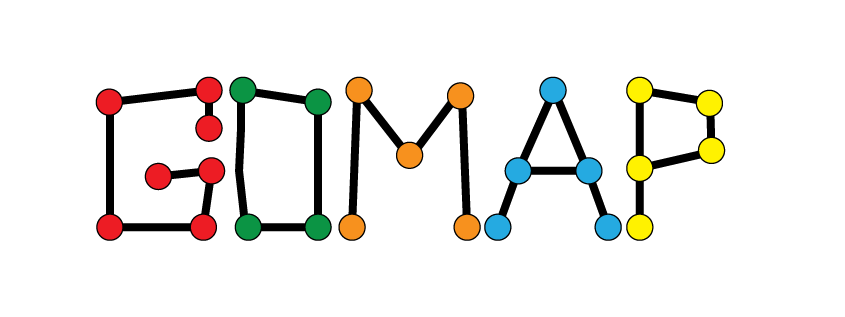

.. GOMAP-singularity documentation master file, created by
   sphinx-quickstart on Wed Jun 27 10:33:50 2018.
   You can adapt this file completely to your liking, but it should at least
   contain the root `toctree` directive.

.. _index:

Welcome to GOMAP-singularity's documentation!
=============================================

**GOMAP-singularity** is the containerized version of the Gene Ontology Meta Annotator for Plants (**GOMAP**) pipeline. **GOMAP** is a high-throughput pipeline to annotate GO terms to plant protein sequences.

How to use GOMAP-singularity
----------------------------

.. toctree:: 
   :maxdepth: 1
   :numbered:
   
   OVERVIEW
   REQUIREMENTS
   RUNNING

   
..   #INSTALL
..   #RUN
..   CONFIG
